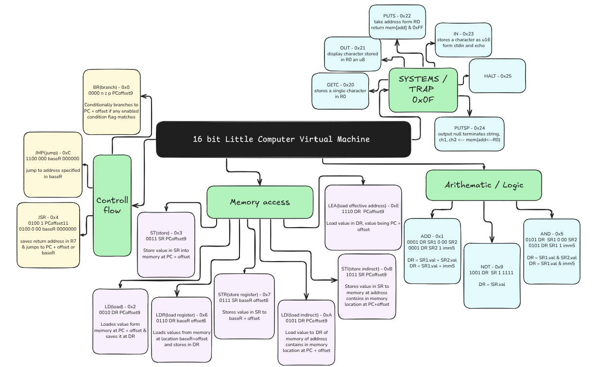

# Little Computer 3 Virtual machine (LC3VM)

Rust implementation of VM that executes LC3 instructions.

Reference: https://www.jmeiners.com/lc3-vm/

## How to run??

Runs for unix based systems, make file exists for a reason

- run 2048.obj
```bash
make run_2048
```

### why it works ? - - magic!!!



**“The view that machines cannot give rise to surprises is due, I believe, to a fallacy to which philosophers and mathematicians are particularly subject. This is the assumption that as soon as a fact is presented to a mind all consequences of that fact spring into the mind simultaneously with it. It is a very useful assumption under many circumstances, but one too easily forgets that it is false.”** — Alan M. Turing


## Opcodes
###  1. BR – Branch

    Opcode: 0000

    Format: BR[n][z][p] PCoffset9

    Description: Branches to a new PC address if condition codes are set.

        N = Negative

        Z = Zero

        P = Positive

    BRnzp LABEL ; Branch unconditionally
    BRz LABEL   ; Branch if zero

### 2. ADD – Add

    Opcode: 0001

    Format:

        Register mode: ADD DR, SR1, SR2

        Immediate mode: ADD DR, SR1, imm5

    Description: Adds two values and stores the result in the destination register.

    ADD R1, R2, R3    ; R1 = R2 + R3
    ADD R1, R2, #5    ; R1 = R2 + 5

### 3. LD – Load

    Opcode: 0010

    Format: LD DR, PCoffset9

    Description: Loads a value from memory using a PC-relative offset.

    LD R1, LABEL

### 4. ST – Store

    Opcode: 0011

    Format: ST SR, PCoffset9

    Description: Stores a register value into memory (PC-relative).

    ST R1, LABEL

### 5. JSR / JSRR – Jump to Subroutine

    Opcode: 0100

    Format:

        JSR PCoffset11

        JSRR BaseR

    Description: Saves PC in R7 and jumps to subroutine.

    JSR FUNC      ; PC = PC + offset
    JSRR R3       ; PC = contents of R3

### 6. AND – Bitwise AND

    Opcode: 0101

    Format:

        Register mode: AND DR, SR1, SR2

        Immediate mode: AND DR, SR1, imm5

    Description: Bitwise AND of two values.

    AND R1, R2, R3
    AND R1, R2, #0xF

### 7. LDR – Load Register

    Opcode: 0110

    Format: LDR DR, BaseR, offset6

    Description: Loads from memory using base register and offset.

    LDR R1, R2, #4

### 8. STR – Store Register

    Opcode: 0111

    Format: STR SR, BaseR, offset6

    Description: Stores register value into memory using base + offset.

    STR R1, R2, #4

### 9. RTI – Return from Interrupt

    Opcode: 1000

    Format: (Unused in LC3VM)

    Description: Used for returning from interrupts. Not used in LC3VM user programs.

### 10. NOT – Bitwise NOT

    Opcode: 1001

    Format: NOT DR, SR

    Description: Bitwise inversion of a register.

    NOT R1, R2  ; R1 = ~R2

### 11. LDI – Load Indirect

    Opcode: 1010

    Format: LDI DR, PCoffset9

    Description: Reads memory at address stored in memory at (PC + offset).

    LDI R1, LABEL

### 12. STI – Store Indirect

    Opcode: 1011

    Format: STI SR, PCoffset9

    Description: Stores a register to memory indirectly.

    STI R1, LABEL

### 13. JMP / RET – Jump

    Opcode: 1100

    Format: JMP BaseR or RET (same as JMP R7)

    Description: Unconditional jump to address in base register.

    JMP R3
    RET       ; Return from subroutine

### 14. RES – Reserved

    Opcode: 1101

    Description: Reserved for future use. Should not appear in any program.

### 15. LEA – Load Effective Address

    Opcode: 1110

    Format: LEA DR, PCoffset9

    Description: Loads the effective address (PC + offset) into a register.

    LEA R1, LABEL

### 16. TRAP – System Call

    Opcode: 1111

    Format: TRAP trapvect8

    Description: Invokes operating system services.

TRAP Codes

Trap Code	Mnemonic	Function
- 0x20	GETC	Read a character from keyboard (no echo)
- 0x21	OUT	Output a character to console
- 0x22	PUTS	Output null-terminated string
- 0x23	IN	Prompt for input and echo it
- 0x24	PUTSP	Output string packed two characters/word
- 0x25	HALT	Halt execution

TRAP Usage Example
```asm
TRAP x20     ; Read character from keyboard
TRAP x21     ; Output a character
TRAP x25     ; Halt the program
```